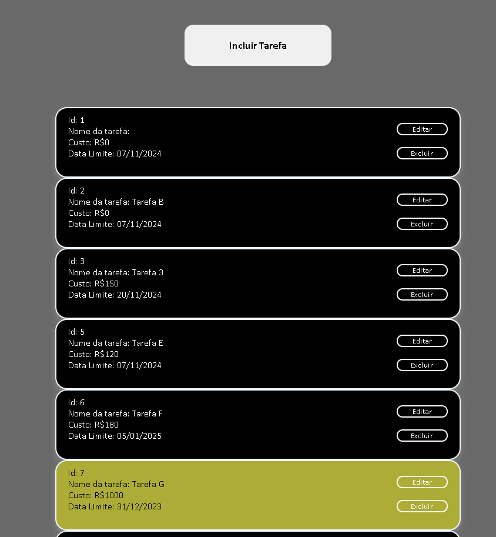

# Lista de Tarefas - Front-End

Este projeto é um **front-end** de uma aplicação de **gerenciamento de tarefas**. O sistema permite aos usuários **editar, excluir, incluir e listar tarefas**. A interface foi construída com **Angular** e utiliza **CDK** para funcionalidades de arrastar e soltar. 

## Funcionalidades

- **Incluir Tarefa**: Permite ao usuário adicionar novas tarefas à lista.
- **Editar Tarefa**: O usuário pode editar o nome, custo e data de uma tarefa.
- **Excluir Tarefa**: O usuário pode excluir uma tarefa existente.
- **Arrastar e Soltar**: As tarefas podem ser reorganizadas utilizando o recurso de drag-and-drop (arrastar e soltar).
- **Exibição de Tarefas**: As tarefas são exibidas com informações como `ID`, `Nome`, `Custo` e `Data Limite`.
  
## Tecnologias Utilizadas

- **Angular**: Framework para a construção da aplicação.
- **Angular CDK**: Biblioteca para implementar a funcionalidade de drag-and-drop.
- **CSS**: Estilos personalizados para a interface de usuário.
  
## Instalação

É necessário ter o MySql instalado e ter configurado o back-end: https://github.com/Thullyoo/lista-tarefa-back

Siga os passos abaixo para rodar o projeto localmente:

1. **Clone o repositório**:
   ```bash
   git clone https://github.com/Thullyoo/lista-tarefa-front.git
2. **Navegue até o diretório do projeto:
   ```bash
   cd lista-tarefa-front
3. **Instale as dependências:
   ```bash
   npm install
4. **Inicie o servidor de desenvolvimento:
   ```bash
   ng serve
5. Acesse a aplicação no navegador:
   ```bash
   http://localhost:4200

<p align="center">
  
</p>


